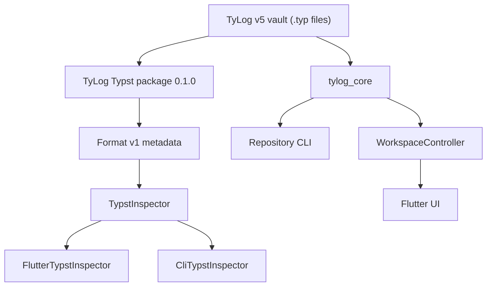

# TyLog ecosystem

TyLog keeps the durable knowledge model outside Flutter. A vault is a normal
directory of Typst documents, the metadata contract is public, and the same
core builds deterministic indexes in the mobile app and repository CLI.



## Compatibility contract

Vault generation remains `5`. Existing notes retain this import:

```typst
#import "/_system/tylog.typ" as tylog
```

The six labels—`<tylog-note>`, `<tylog-link>`, `<tylog-tag>`,
`<tylog-date>`, `<tylog-attachment>`, and `<tylog-task>`—also remain stable.
Format v1 wraps each value with `schema: 1` and a matching `entity`. Readers
accept both these envelopes and legacy generation-5 values. See
[the complete format specification](../spec/tylog-format-v1.md).

A fresh vault receives the facade, theme, export helper, and vendored package
from application assets. The facade pins
`_system/packages/tylog/0.1.0/lib.typ`, so the official Typst CLI can compile a
vault offline. Initialization upgrades only the exact known legacy helper.
Custom helpers and themes are preserved; validation reports a compatibility
warning instead of overwriting them. Versioned package files are managed and
may be repaired from bundled assets.

## Components

### Typst package

[`typst/tylog`](../typst/tylog/README.md) contains the semantic API and the
small default visual layer. `note` emits metadata and its body, with an
optional body transform. `document` owns page, font, and heading styling.
Task and tag views can change without altering metadata. The canonical task
form is `tylog.task(text: "...")` because the metadata contract requires a
plain string.

Registry publication is deferred. Vaults use the vendored package and do not
depend on `@preview` or network access.

### Flutter-independent core

[`packages/tylog_core`](../packages/tylog_core) contains models, storage,
metadata decoding, fallback source parsing, link resolution, deterministic
index and search construction, validation, reports, and pure graph building.
It imports neither Flutter nor `typst_flutter`.

`VaultStorage` exposes only safe vault-relative list, stat, read, write,
delete, directory creation, and hash operations. Platform file picking,
materialization, importing, and external opening stay in the Flutter app.

Indexing queries all Typst metadata once per document. The core filters the
six labels and accepts legacy or Format v1 values. If an inspector is absent
or a document fails to compile, the index records a warning and applies the
safe fallback parser. Broken source therefore does not silently erase links
or tasks from derived indexes.

### Runtime adapters and Flutter app

`FlutterTypstInspector` adapts the embedded `TypstCompiler`.
`CliTypstInspector` invokes official Typst 0.15.0 or newer with
`typst eval "query(metadata)"`. Both implement the same `TypstInspector`
contract.

`WorkspaceController` owns vault lifecycle, note source and autosave,
indexing, sync and conflicts, search, validation, and task reconciliation.
`app_mobile.dart` retains dialogs, navigation, file pickers, editor widgets,
and view state. No additional state-management package or speculative service
layer is involved.

## Repository CLI

The first CLI is intentionally repository-local. Run it from the core package:

```sh
cd packages/tylog_core
dart run bin/tylog.dart init [vault]
dart run bin/tylog.dart index [vault] [--force]
dart run bin/tylog.dart doctor [vault]
dart run bin/tylog.dart export <file.typ> [output.pdf]
```

- `init` creates a generation-5 vault and installs its managed Typst files.
- `index` writes `_index/index.json` and `_index/search-index.json.gz`.
- `doctor` prints validation results and exits nonzero only for errors.
- `export` calls official `typst compile` directly.

`index` and `doctor` fall back safely when a document fails to compile. A
missing Typst executable is reported as a clear operational error. Standalone
CLI packaging is deferred until this interface has proven stable.

## Verification

Typst 0.15.0 or newer and Flutter stable with Dart 3.12 or newer are required.

```sh
make test-core
make test-typst
flutter analyze
flutter test
flutter test integration_test/pkms_native_test.dart -d macos
flutter build apk --release
flutter build macos --release
```

The native integration test compares normalized Format v1 metadata from the
official CLI and embedded runtime, then verifies fallback indexing on
intentionally malformed source. `make verify` runs the full local gate,
including both release builds.

Package registry support in the embedded runtime, app relocation, Rust core,
SQLite, filesystem watchers, servers, plugins, and other P2 platform work are
deliberately deferred.
